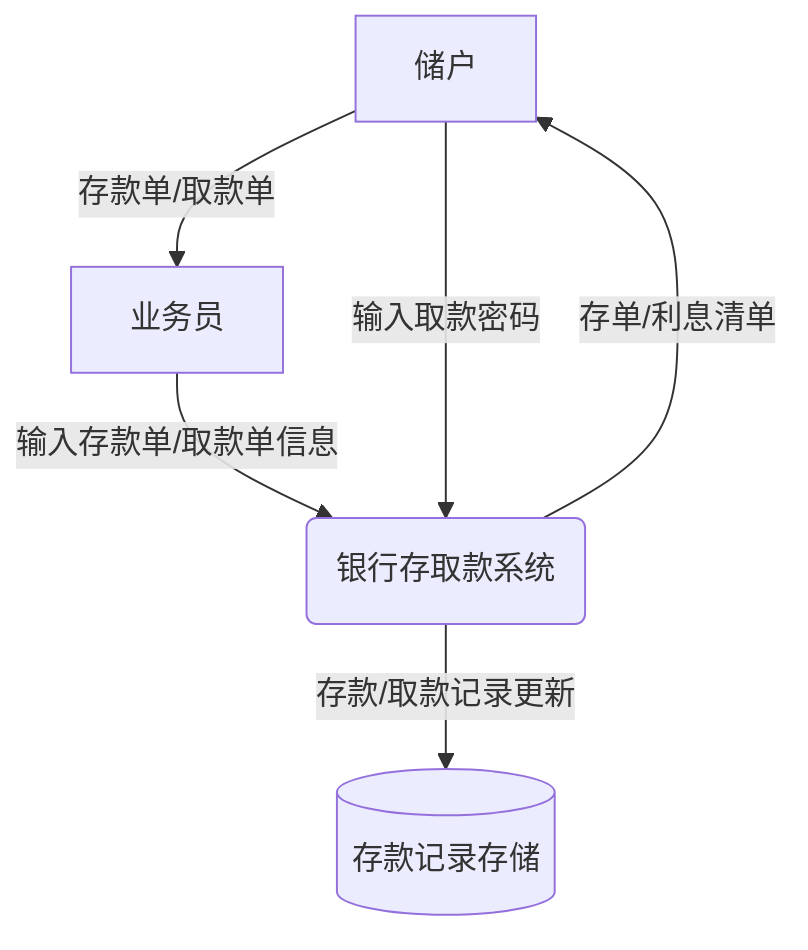
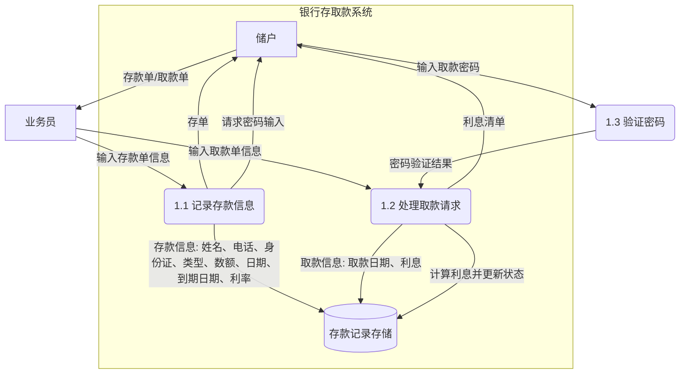

### 0级数据流图（上下文图）
0级数据流图展示系统与外部实体（储户和业务员）之间的交互。

**说明**：
- 外部实体：储户和业务员。
- 系统：银行存取款系统（作为一个整体过程）。
- 数据存储：存款记录存储。
- 数据流：存款单/取款单信息、取款密码、存单/利息清单等。

---

### 1级数据流图
1级数据流图将“银行存取款系统”细化为多个子过程，包括存款处理、取款处理、密码验证等。

**说明**：
1. **过程 1.1 记录存款信息**：
   - 输入：业务员输入的存款单信息（姓名、电话、身份证号码、存款类型、数额、日期、到期日期、利率）。
   - 输出：存单给储户，存款信息存入数据存储。
   - 储户通过 keypad 输入取款密码（假设与存款记录关联）。

2. **过程 1.2 处理取款请求**：
   - 输入：业务员输入的取款单信息。
   - 子过程：调用密码验证（1.3），若正确，计算利息，更新存款记录状态，记录取款日期和利息。
   - 输出：利息清单给储户。

3. **过程 1.3 验证密码**：
   - 输入：储户通过 keypad 输入的取款密码。
   - 输出：验证结果给过程 1.2。

4. **数据存储 D1（存款记录存储）**：
   - 存储存款信息和取款更新信息。

