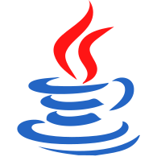
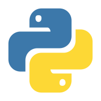
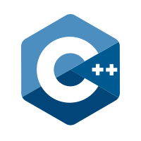
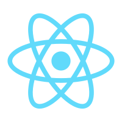
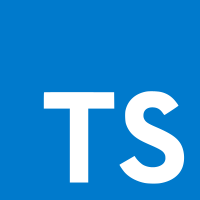
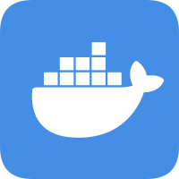

    

  &emsp;
  &emsp;
  &emsp;
  &emsp;
  &emsp;
  &emsp;

我是 [Lingtao Yang] 👨‍💻
---

Hello，我是一位软件工程学习者 + 编程爱好者 + 团队协作新手：
- 😭一名计算机相关专业学生，正在为软件工程课程的作业和项目熬夜中 o(╥﹏╥)o
- 🐳喜欢记录学习过程和分享经验，欢迎访问我的[个人博客](https://www.weilanx.com/)
- 💫立志成为一名优秀的软件工程师 \(^o^)/~ 在代码和文档中不断成长！

## 仓库简介
这是一个为 **软件工程课程** 创建的 GitHub 仓库，包含课程笔记、实验代码、项目实践和团队作业。希望通过这个仓库，记录我的学习旅程，并为其他同学提供参考。

### 主要内容
- 📚 **课程笔记**：软件工程基础理论、UML 图、设计模式等。
- 💻 **实验代码**：需求分析、系统设计、测试用例的实现。
- 🚀 **项目实践**：团队合作开发的模拟项目，包含完整开发流程。
- 📊 **工具使用**：Git 版本控制、CI/CD 实践、文档编写。

## 技术栈
软件工程的江湖，技能越多越好：
- 🥸熟悉 `Java` 和 `Python`，能写出优雅的 CRUD 代码。
- 🧑‍💻面向 `Stack Overflow` 和 `GPT` 编程，问题总有解决办法。
- 🎀略懂前端，`HTML` + `CSS` + `JavaScript`，页面也能凑合画。
- 🎋版本控制小能手，`Git` 用得飞起，`commit` 消息写得像诗。
- 🥘被代码耽误的文档大师，Markdown 写得比程序还溜。

<table>
  <tr align="center">
    <td align="center" width="96">
      
       Java
    </td>
    <td align="center" width="96">
      
       Python
    </td>
    <td align="center" width="96">
      
       C++
    </td>
    <td align="center" width="96">
      
       React
    </td>
    <td align="center" width="96">
      
       Linux
    </td>
    <td align="center" width="96">
      
       TavaScript
    </td>
    <td align="center" width="96">
      
       Docker
    </td>
  </tr>
</table>

## 课程亮点
记录一些有趣的实验和项目：
- ✡️ **实验 1：银行存取款系统**  
  用 UML 绘制数据流图，实现了存款和取款的业务逻辑 | [代码地址](./01银行定期存取款系统.md)

    

---

欢迎 Star ⭐ 和 Fork 🍴 这个仓库，一起学习软件工程的奥秘吧！